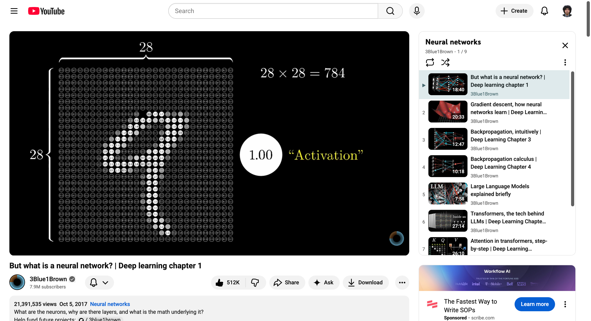
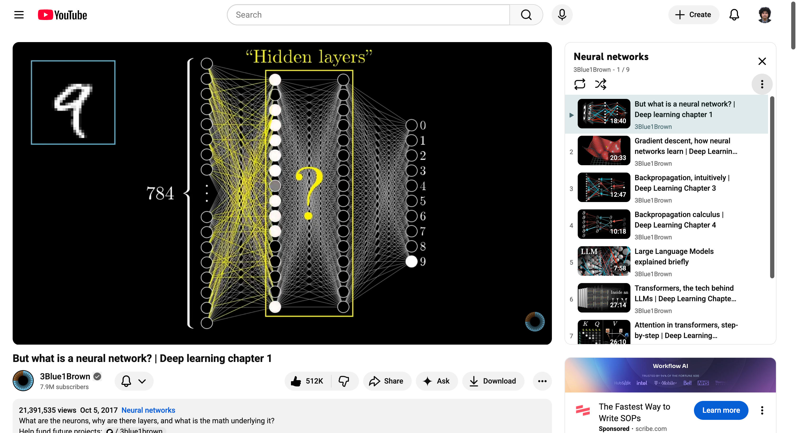
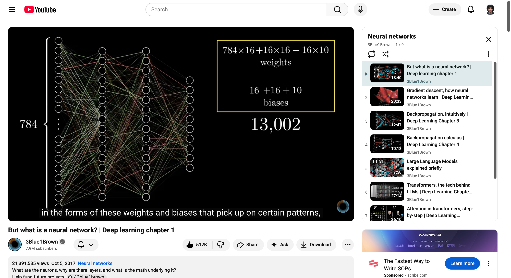
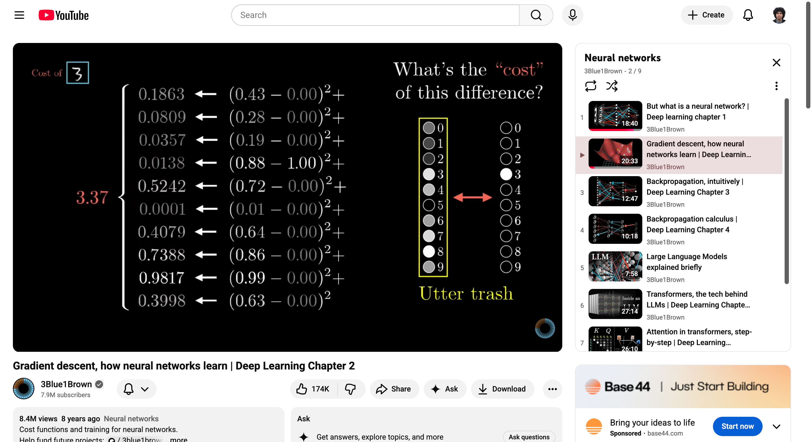
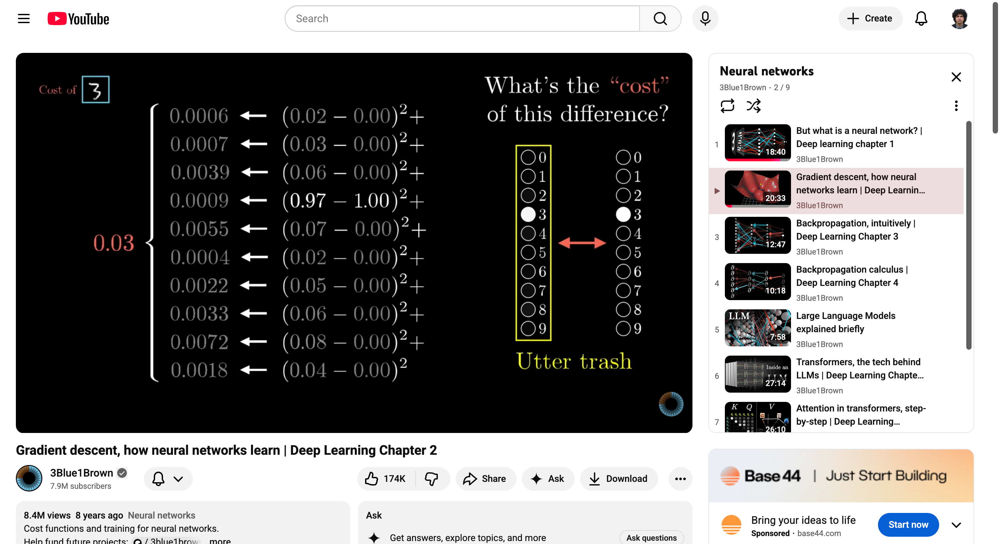
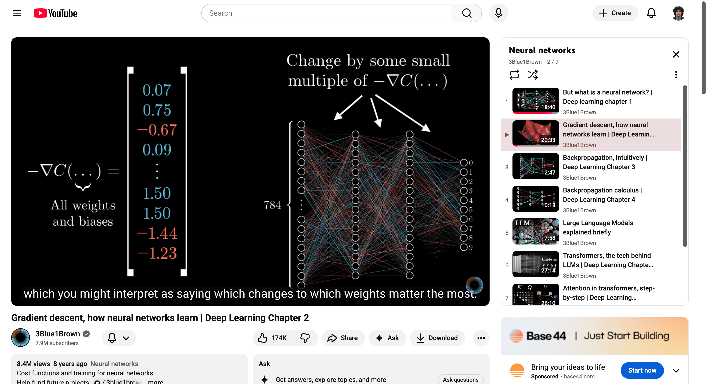
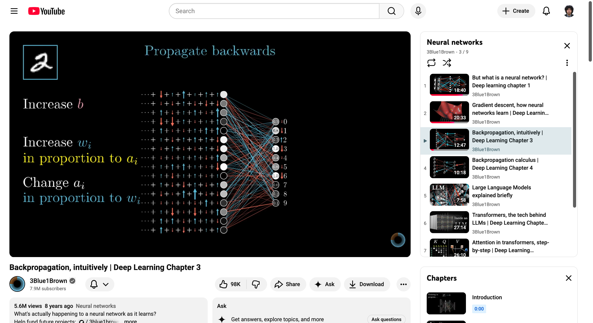
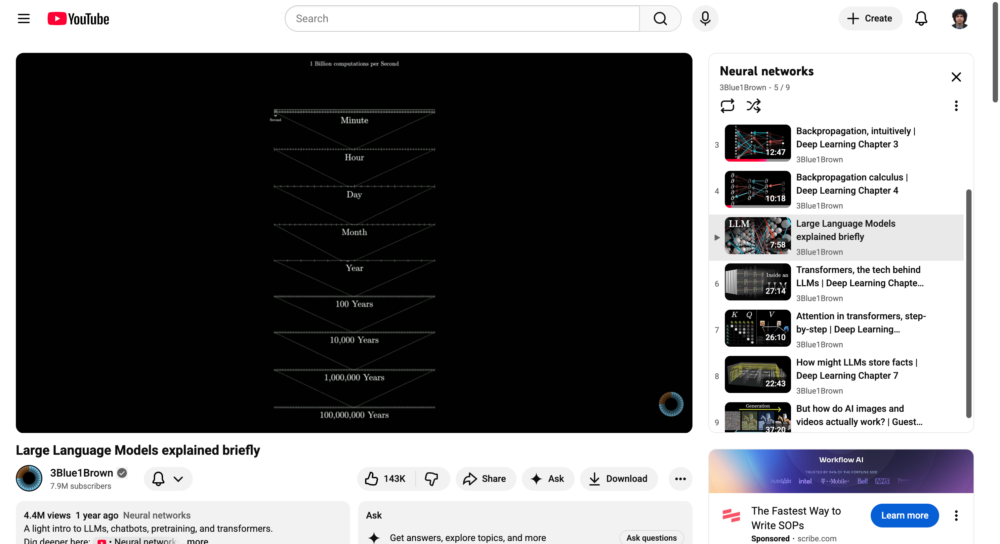
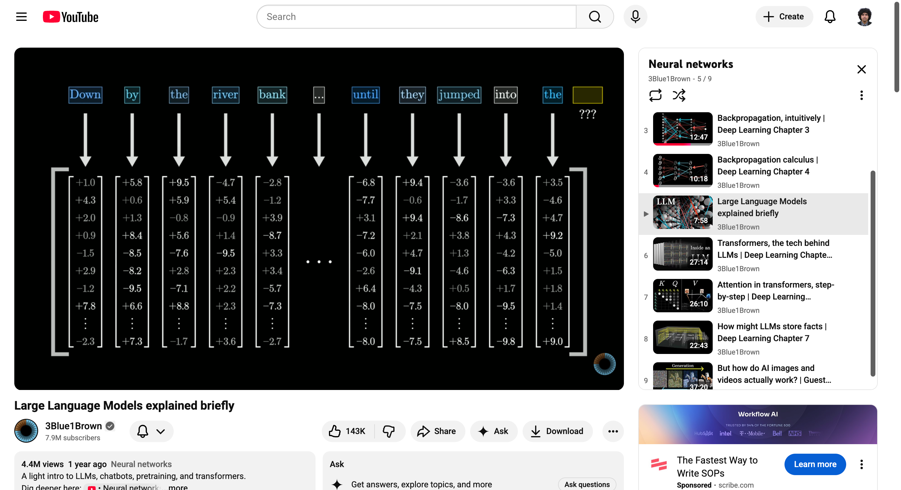

# Assignment 2 Summary - Neural Networks Video Series

**Student:** Ardavan Mehdizadeh  
**Date:** November 24, 2025
**Playlist:** 3Blue1Brown - Neural Networks

---

## Screenshot 1: Input Layer Activation (Video 1)

It shows the 28×28 pixel image of a handwritten digit "9" being fed into the first layer of 784 neurons. Each pixel's brightness is represented by the "activation" of a neuron, visualized by how brightly it's lit up.

This visualization made it immediately clear how raw image data is converted into numerical inputs for the network. Before seeing this, I understood conceptually that "pixels become numbers," but this showed the direct mapping: one pixel = one neuron activation value between 0 and 1.

---

## Screenshot 2: Hidden Layers Architecture (Video 1)

It shows the complete network architecture with input layer (784 neurons), two hidden layers (16 neurons each), and output layer (10 neurons), all fully connected.

This clarified the overall information flow from input to output. Initially, the hidden layers seemed like a "black box," but now I understand that specific patterns of activations in one layer cause very specific patterns in the next layer. This cascading of activation information is how the network builds hierarchical representations which early layers detect edges, middle layers detect patterns, final layers detect digits. This directly connects to GNNs in materials science, where layers aggregate information from increasingly distant neighbors.

---

## Screenshot 3: Weights and Network Parameters (Video 1)

It shows the network architecture with the parameter count displayed: 784×16 + 16×16 + 16×10 weights, plus 16 + 16 + 10 biases, totaling 13,002 parameters.

This made concrete what "learning" means which is adjusting these 13,002 numbers to recognize patterns. The formula for counting parameters (weights between layers + biases) is now clear. It also explains why feature engineering can be so powerful with reducing the input dimension (from 784 to 100 features) dramatically reduces the parameter count.

---

## Screenshot 4: Cost Function Introduction (Video 2)

It shows the cost function calculation showing the squared differences between network output and desired output. The total cost sums these squared differences across all 10 output neurons.

This introduced how to quantify the network's "badness" when it makes wrong predictions. With random initial weights, the network performs poorly. The cost function measures this by computing the sum of squared differences between actual and desired activations. When the network confidently classifies correctly (like the second image shows with cost = 0.03), the cost is low. When it's wrong (first image, cost = 3.37), the cost is high. This connects directly to mean squared error and other loss functions we use in materials ML.

---

## Screenshot 5: Gradient Descent Intuition (Video 2)

The same cost function calculation but when the network correctly classifies the digit. The network outputs something close to. The total cost is now only 0.03.

This demonstrates that when the network classifies correctly, the cost function drops dramatically from 3.37 to 0.03. The squared differences are now tiny because the actual output closely matches the desired output. This visualization made it clear that the cost function successfully quantifies network performance where high cost means bad predictions, low cost means good predictions. This is exactly the principle behind all loss functions in ML.

---

## Screenshot 6: Gradient Descent Visual Interpretation (Video 2)

The gradient vector -delC(...) with its values visualized as arrows pointing to different weights in the neural network. As the teller says "which you might interpret as saying which changes to which weights matter the most."

This was crucial for understanding that the gradient isn't just abstract numbers. It has direct physical meaning. Each component of the gradient tells you that large positive/negative values have a big impact on cost changing them will significantly affect the output.
Small values, these weights don't matter much for this particular training and changing them won't help much.

This interpretation helps explain why some weights learn faster than others during training. Weights with large gradient components get updated more aggressively, while weights with small gradients barely change. 

---

### Screenshot 7: Backpropagation - Three Ways to Adjust (Video 3)

Backpropagation isn't magic - it's systematically asking "what changes would help?" and working backwards. Each layer asks: which weights, biases, and previous activations should change, and by how much? The algorithm prioritizes changes involving brighter neurons and larger weights because those have bigger impacts. This recursive process (propagating backwards) efficiently computes gradients for all 13,002 parameters.

---

### Screenshot 8: Scale of LLM Training Computation (Video 5)

A time scale visualization showing different time units for computational scale of training a large language models, starting from Minute, Hour, Day, Month, Year, 100 Years, 10,000 Years, 1,000,000 Years, and finally reaching to 100,000,000 Years at the bottom for even if we were able have computating ability of 1 Billion computations per Second!

---

## Screenshot 9: Word Embeddings in Transformers (Video 5)

This visualization clarified the fundamental difference between transformers and earlier language models. Before 2017, language models processed text one word at a time sequentially. Transformers revolutionized this by converting all words into numerical vectors (embeddings) simultaneously and processing them in parallel. This reminded me of batched computation in materials ML tools like TorchSim or batched MLIP inference can calculate energies and forces for thousands of structures simultaneously on GPUs instead of processing them one at a time sequentially. Unlike sequential models, transformers process all words simultaneously. This makes them much faster to train (can use GPUs efficiently) and better.

---

## Screenshot 10: Attention Block - Context-Dependent Meaning (Video 6)

This visualization clarified how transformers handle words with multiple meanings. Words are represented as vectors in high-dimensional space, but a word like "model" could mean a machine learning model or a fashion model. The attention mechanism solves this ambiguity by letting word vectors look at their surrounding context when "model" appears near "machine learning", the attention block updates its vector to represent the machine learning model meaning instead of the fashion model meaning. This context-aware refinement happens for all words simultaneously, which is why transformers are so effective at understanding language nuances.

---